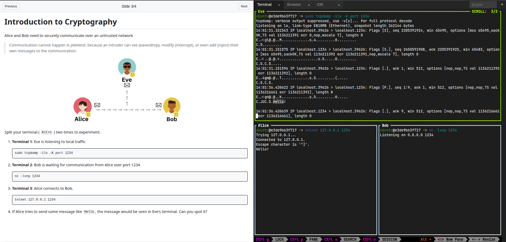

# interactive-labs

Complement your IT training workshops with a practice environment.



## Quick Start (Docker)

1. Start from a given [docker-compose.yaml](./docker-compose.yaml) or [docker-compose-sysbox.yaml](./docker-compose-sysbox.yaml)

1. Prepare a `workshop` directory with your lab content (refer to our [example](./workshop))

1. Run the lab with `docker compose up -d`

1. Access at <http://localhost:3000>

## Quick Start (Vagrant)

1. Setup the Virtual Machine Manager (VMM) for your platform

- Windows: [Hyper-V Manager](https://learn.microsoft.com/en-us/windows-server/virtualization/hyper-v/get-started/install-hyper-v)
- Linux: [QEMU/KVM + Libvirt + virt-manager](https://christitus.com/vm-setup-in-linux/)
- MacOS: [UTM](https://mac.getutm.app/) (with [utmctl](https://docs.getutm.app/scripting/scripting/#command-line-interface))
- Hosted (Type-2) Hypervisor: [VirtualBox](https://www.virtualbox.org/wiki/Downloads)

1. Download the corrsponding box from our [Release](https://github.com/Sh3b0/interactive-labs/releases/tag/boxes) page and import it into vagrant

  ```bash
  vagrant box add --name labenv <path_to_box_file>
  ```

1. Install a plugin to integrate with the VMM (no plugins needed for VirtualBox/Hyper-V)

  ```bash
  vagrant plugin install <vagrant-libvirt|vagrant_utm>
  ```

1. Run the enivonment and access at `http://<VM-IP>:3000`

  ```bash
  vagrant up --provider <hyperv|libvirt|utm|virtualbox>
  ```

## Local Development

```bash
cd labenv
npm install
npm run dev
```

## Local Building

- Container Environment

  ```bash
  cd labenv
  docker buildx create --name mybuilder --use
  docker buildx build --platform linux/amd64,linux/arm64 -t labenv:dev --load .
  docker run -d -p3000:3000 labenv:dev
  ```

- Virtual Machine Environment

  1. Ensure your have Packer, Vagrant, and the required VMM installed

  1. Download Ubuntu 24.04 base box ([Hyper-V](https://portal.cloud.hashicorp.com/vagrant/discover/sture/ubuntu2404), [Libvirt/VirtualBox](https://portal.cloud.hashicorp.com/vagrant/discover/cloud-images/ubuntu-24.04), [UTM](https://portal.cloud.hashicorp.com/vagrant/discover/utm/noble))

  1. Import it into Vagrant

    ```bash
    vagrant box add --name <name> <path_to_box_file>
    ```

  1. Run the build

   ```bash
    cd labenv
    packer init .
    packer build labenv.pkr.hcl
    ```

  1. If successful, release artifact should be available at `labenv/output/<provider>/package.box`

## Courses

Check out some courses utilizing the platform:

- Fundamentals of Information Security: <https://github.com/Inno-CyberSec/FIS-F25>
- Network and Cyber Security: <https://github.com/Inno-CyberSec/NCS-F25>
