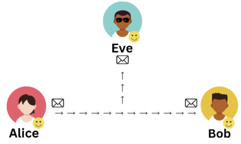

# Introduction to Cryptography

Alice and Bob need to securely communicate over an untrusted network

> Communication cannot happen in *plaintext*, because an intruder can see (eavesdrop), modify (intercept), or even add (inject) their own messages to the communication.

<p align="center"> </p>

Split your terminal ( `Alt + []` ) to experiment.

1. **Terminal 1**: Eve is listening to local traffic

   ```bash
   sudo tcpdump -ilo -A port 1234
   ```

2. **Terminal 2**: Bob is waiting for communication from Alice over port 1234

   ```bash
   nc -lvnp 1234
   ```

3. **Terminal 3**: Alice connects to Bob.

   ```bash
   telnet 127.0.0.1 1234
   ```

4. If Alice tries to send some message like `Hello`, the message would be seen in Eve's terminal. Can you spot it?
